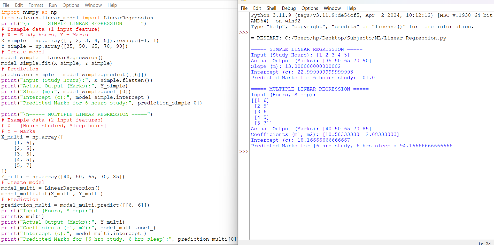

#  Regression Models in Python

##  About
This project implements:
- Simple Linear Regression
- Multiple Linear Regression

##  Technologies
- Python
- NumPy

##  How to Run
1. Download the file
2. Open Python IDLE
3. Run the program

##  Output
- Calculates slope and intercept
- Predicts output values

##  Learning Outcome
- Understood regression concepts
- Learned prediction techniques
##  Output Screenshot

